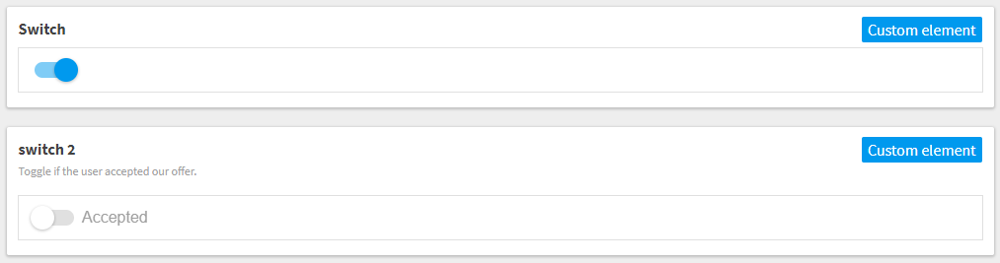

# Toggle Switch Custom Element for Kentico Kontent

This is a [custom element](https://docs.kontent.ai/tutorials/develop-apps/integrate/integrating-your-own-content-editing-features) for [Kentico Kontent](https://kontent.ai) that allows you to toggle a switch on or off.



## Setup

1. Deploy the code to a secure public host
    * See [deploying section](#Deploying) for a really quick option
1. Follow the instructions in the [Kentico Kontent documentation](https://docs.kontent.ai/tutorials/develop-apps/integrate/integrating-your-own-content-editing-features#a-3--displaying-a-custom-element-in-kentico-kontent) to add the element to a content model.
    * The `Hosted code URL` is where you deployed to in step 1
    * Pass any desired optional parameters as directing in the [JSON Parameters configuration](#json-parameters) section of this readme.

## Deploying

Netlify has made this easy. If you click the deploy button below, it will guide you through the process of deploying it to Netlify and leave you with a copy of the repository in your GitHub account as well.

[](https://app.netlify.com/start/deploy?repository=https://github.com/hzik/kc_inputs)

## JSON Parameters

You are not required to specify any parameters to use this custom element. If desired, you can configure the default state or a label for the toggle.

`default` is an optional boolean value indicating the default state of the toggle on first load.

`label' is an optional string value used as the label to the right of the toggle to provide additional context to an editor.

```Json
{
    "default": true,
    "label": "Featured"
}
```

## Saved Value

The value is saved as a string of true or false representing the switch's state.
